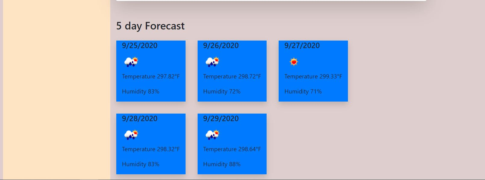

# Weather Web App
This is a daily planner web page made from HTML,JQUERY and MOMENT.JS and also using API's
​
## Contents

The web-site is composed of 2 pages, index.html ,script.js and. It also has images in the img folder with an image of the application

[License](#License)
​
## User Story

As a Web Developer,
I had to madke an weather web app for end users to check weather
So that end users are able to plan their day.

​
## Built With
​
* [VScode](https://code.visualstudio.com/) - The editor of choice
* [Terminal](https://gitforwindows.org/) - Git Bash
* [Moment.js](https://momentjs.com/) - Moment.js
*[OpenWeatherAPI](https://openweathermap.org/) - OpenWeather API
 
​
#### Initial interface and #### Final Interface

The following image demonstrates the application functionality:

​
​
### Licence
​
I have provided a License document on the Git Repository
​
### Link to the App
<a href="https://amankmr4.github.io/WeatherApp/">Link to the Website</a>
https://amankmr4.github.io/WeatherApp/

<a href="https://github.com/amankmr4/WeatherApp.git">Link to the GitRepository</a>
https://github.com/amankmr4/WeatherApp.git

​
## Author
​
* Aman Kumar

​
## Acknowledgments
​
* To 
- Klaus Paiva
- Sandes Pathak
